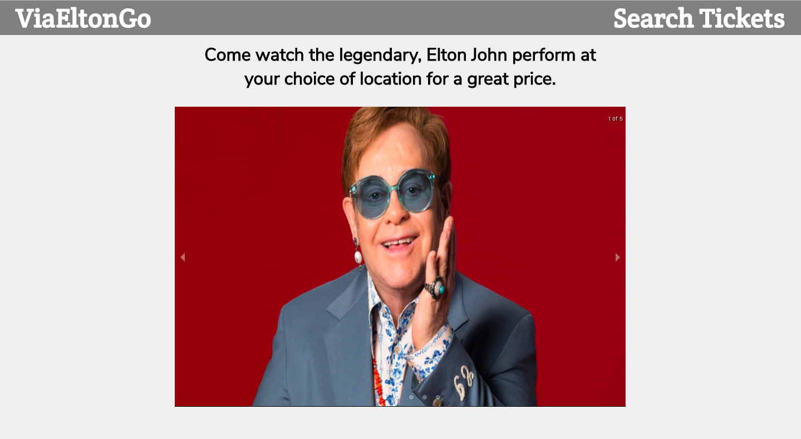
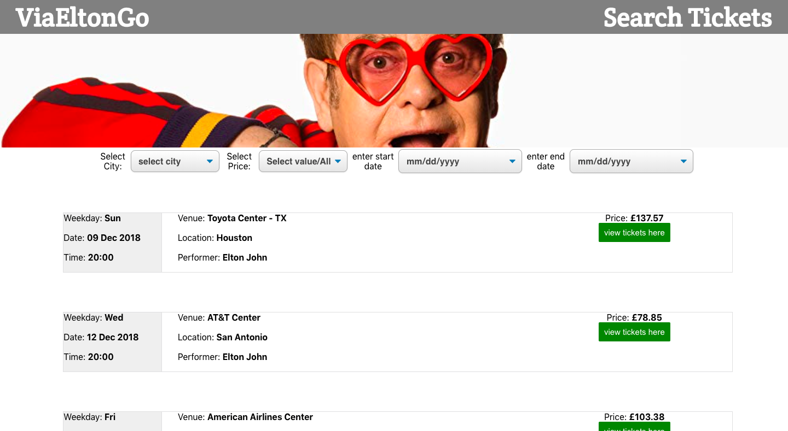
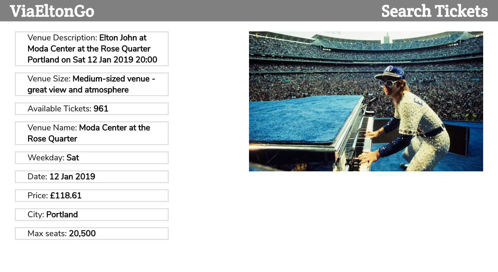

# Viagogo Project

# ViaEltonGo

## Minimum Viable Product

---

ViaEltonGo is a project that will use a given JSON file that has data on venues that Elton will perform at. Project will use that data and display it for a customer to purchase tickets to watch Elton John perform on stage.

Customer will be able to

- select dates for performance
- select desired location
- select pricing
- view details about selected event

---

## Design Docs

---

- ### [View wireframes](./DOCS/wireframes)

---

## For Viagogo's coding project requirements and my feedback, please click "Viagogo's questions and answers"

---

- ### [Viagogo's questions and answers](./DOCS/RECAPFILE.md)

---

## how to run application?

---

- Please clone my project to local machine. Once cloned, please cd into project folder and npm install. Once all packages installed please run, npm start and a localhost:3000 will appear with ViaEltonGo application in your web browser. Thank you.

---

## Screenshots of application

---

- landing page of ViaEltonGo. it is using a carousel that displays five images that is on a continuous loop.

---

- Using Viagogo's JSON file data, this component was populated with all the information a user would like to know before purchasing a ticket. Users are able to filter tickets by location and prices. A green button will lead users to more detailed information about the specific event they would like to attend.

---

-After clicking button for more details, based on EventId info, it will populate this component on everything relating to users selected pick, along with showing a cool picture of Elton John playing in front of an audience.

---
